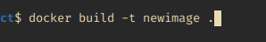
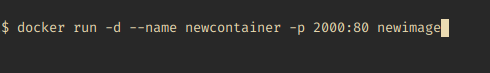

## About the project:

This is a capstone project for free machine learning course ([mlzoomcamp](https://github.com/alexeygrigorev/mlbookcamp-code)).
Thanks for an amazing course Mr. [Alexey grigorev](https://github.com/alexeygrigorev) and the entire [DataTalks.club](https://www.youtube.com/watch?v=wWBm6MHu5u8&list=PL3MmuxUbc_hIhxl5Ji8t4O6lPAOpHaCLR&index=1) teams.

### The problem:-
The data is related with direct marketing campaigns (phone calls) of a Portuguese banking institution. The classification goal is to predict if the client will subscribe a term deposit (variable y).

### The Dataset:- 
	./data/bank_marketing_test.csv
	./data/bank_marketing_train.csv

> Original Site: [https://archive.ics.uci.edu/ml/datasets/bank+marketing]

### Data Set Information:

The data is related with direct marketing campaigns of a Portuguese banking institution. The marketing campaigns were based on phone calls. Often, more than one contact to the same client was required, in order to access if the product (bank term deposit) would be ('yes') or not ('no') subscribed.

There are four datasets:
- 1) bank-additional-full.csv with all examples (41188) and 20 inputs, ordered by date (from May 2008 to November 2010), very close to the data analyzed in [Moro et al., 2014]
- 2) bank-additional.csv with 10% of the examples (4119), randomly selected from 1), and 20 inputs.
- 3) bank-full.csv with all examples and 17 inputs, ordered by date (older version of this dataset with less inputs).
- 4) bank.csv with 10% of the examples and 17 inputs, randomly selected from 3 (older version of this dataset with less inputs).


The smallest datasets are provided to test more computationally demanding machine learning algorithms (e.g., SVM).
The classification goal is to predict if the client will subscribe (yes/no) a term deposit (variable y).

>[Note: We will be using data with 41118 rows, and the data has been split in 70/30 ratio.]


**Attribute Information:**

 Input variables:
( bank client data:)
 - 1 - age (numeric)
 - 2 - job : type of job (categorical: 'admin.','blue-collar','entrepreneur','housemaid','management','retired','self-employed','services','student','technician','unemployed','unknown')
 - 3 - marital : marital status (categorical: 'divorced','married','single','unknown'; note: 'divorced' means divorced or widowed)
 - 4 - education (categorical: 'basic.4y','basic.6y','basic.9y','high.school','illiterate','professional.course','university.degree','unknown')
 - 5 - default: has credit in default? (categorical: 'no','yes','unknown')
 - 6 - housing: has housing loan? (categorical: 'no','yes','unknown')
 - 7 - loan: has personal loan? (categorical: 'no','yes','unknown') 

Related with the last contact of the current campaign:

 - 8 - contact: contact communication type (categorical: 'cellular','telephone')
 - 9 - month: last contact month of year (categorical: 'jan', 'feb', 'mar', ..., 'nov', 'dec')
 - 10 - day_of_week: last contact day of the week (categorical: 'mon','tue','wed','thu','fri')
 - 11 - duration: last contact duration, in seconds (numeric). Important note: this attribute highly affects the output target (e.g., if duration=0 then y='no'). Yet, the duration is not known before a call is performed. Also, after the end of the call y is obviously known. Thus, this input should only be included for benchmark purposes and should be discarded if the intention is to have a realistic predictive model.
[other attributes:]
 - 12 - campaign: number of contacts performed during this campaign and for this client (numeric, includes last contact)
 - 13 - pdays: number of days that passed by after the client was last contacted from a previous campaign (numeric; 999 means client was not previously contacted)
 - 14 - previous: number of contacts performed before this campaign and for this client (numeric)
 - 15 - poutcome: outcome of the previous marketing campaign (categorical: 'failure','nonexistent','success')

Social and economic context attributes:
 - 16 - emp.var.rate: employment variation rate - quarterly indicator (numeric)
 - 17 - cons.price.idx: consumer price index - monthly indicator (numeric)
 - 18 - cons.conf.idx: consumer confidence index - monthly indicator (numeric)
 - 19 - euribor3m: euribor 3 month rate - daily indicator (numeric)
 - 20 - nr.employed: number of employees - quarterly indicator (numeric)

Output variable (desired target):
 - 21 - y - has the client subscribed a term deposit? (binary: 'yes','no')


### Downloading the project

1. Clone the repo
- ``git clone https://github.com/xettrisomeman/capstoneproject``
2. Check directory
- ``cd capstoneproject``
3. Installing Dependencies


# Installing Dependencies

You can find requirements.txt file in the directory.
You can use conda or pipenv to create virtual environment to install required library locally.

### Using Conda

Install Conda [windows]
	- follow this link -> https://docs.conda.io/projects/conda/en/latest/user-guide/install/download.html

Install Conda [linux]
	- follow this link -> https://docs.anaconda.com/anaconda/install/linux/


**creating a new conda env using our requirements.txt file**

- ``conda create --name <env_name> --file requirements.txt``

**activate the environment**

- ``conda activate <env_name>``

**deactivate the environment**
- ``conda deactivate``


### Using pipenv

1. Install pipenv
	```pip install pipenv```

2. run pipenv by typing ``pipenv shell`` in your command promt or terminal. It will create a new virtual environment in the current directory.

3. check the dependencies ```pip list```

4. Install the required library using pip
  	- pip install -r requirements.txt

5. To exit or stop pipenv shell type ``exit`` in terminal.

# To run the project

> We can run project in two different way. Running locally or running using docker container.


### Running locally

Type following things in a terminal or in a command prompt 
```python 
python predict.py
```
> Note: Now the program has run , you can visit to http://127.0.0.1:5000/docs and make a prediction.


### Running using docker

To run using docker, we have to go through some steps.
The steps are mentioned below:

**Building the docker image**

- To build the docker image we have to run following command
	- ``docker build -t <name_of_image> .``

		docker build :  will build the image.

		-t : custom naming the project/image

		. : the full stop at the end means , build in current directory.
	
-Example: 




**Running the docker container**

- To create and run the docker container, type following command in a command prompt or in terminal.
	- type ``docker run -d ---name <container_name> -p <desired_port>:80 <name_of_image>``

		 docker run will run the image

		 -d: means run in detach mode (does not show the details of what's going under the hood)

		 --name: giving container a name (if name already exists then it won't create the container if not it will create a new container with provided name)

		 -p: port, 80 is used to communicate with web and transfer web pages, we can custom provide a port to connect with the server.
		 and at the end we have to tell which image to run.


> Note if docker says there already exist container with the provided name, then try to providing different name.

- Example



> Now go to http://localhost:2000/docs and make a prediction.

**Stop the running container**

- type ``docker container stop <name_of_container>/<id_of_container>``

**Start the stopped container**

- type ``docker start <container_id>/<container_name>``

**Remove the container/image**

- To remove container type ``docker rm <container_name>``
- To remove image type ``docker rmi <name_of_image>``


> Citation
>
> Moro et al., 2014] S. Moro, P. Cortez and P. Rita. A Data-Driven Approach to Predict the Success of Bank Telemarketing. Decision Support Systems, Elsevier, 62:22-31, June 2014
